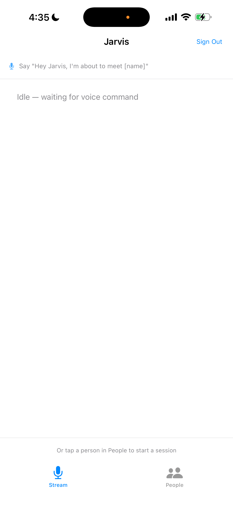
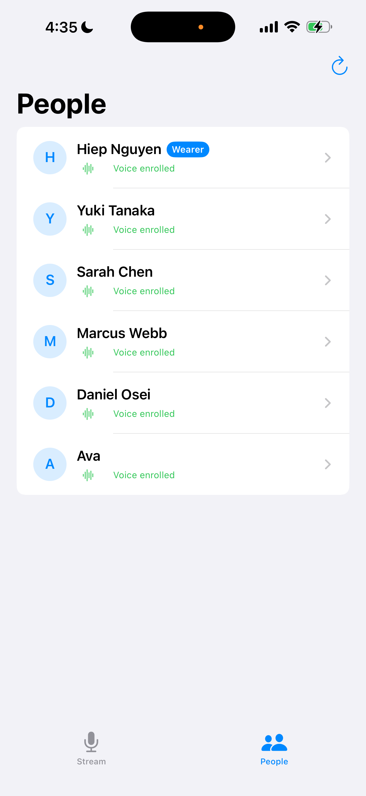
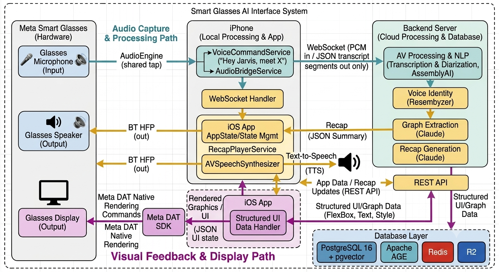

<div align="center">

<!-- 🖼 MISSING: banner.png — wide hero image (1280×640px recommended) -->
<!-- Replace the line below once you have it -->
<h1>🧠 Jarvis</h1>

<br>

[](backend/)
[](mobile/ios/)
[](https://anthropic.com)
[](https://assemblyai.com)
[](LICENSE)

</div>

---

<details>
<summary><strong>📑 Table of Contents</strong></summary>

- [👋 What is Jarvis?](#-what-is-jarvis)
- [✨ See it in action](#-see-it-in-action)
- [🏗️ Architecture](#-architecture)
- [🧠 Intelligence pipeline](#-intelligence-pipeline)
- [📱 iOS app](#-ios-app)
- [💻 Local setup](#-local-setup)
- [🔌 API reference](#-api-reference)
- [⚙️ Configuration](#-configuration)

</details>

## 👋 What is Jarvis?

**Jarvis is a wearable AI memory system for smart glasses.** It listens to your conversations, identifies who's speaking by voice, and builds a living knowledge graph for every person you meet. The next time you see them, it plays a spoken briefing through your glasses — before you even say hello.

The whole experience is hands-free. Say *"Hey Jarvis, I'm about to meet Sarah"* and Jarvis speaks a two-sentence brief drawn from everything it knows about her. When you're done, say *"Hey Jarvis, stop"* and it extracts new knowledge automatically. No tapping. No phone out.

## ✨ See it in action

<div align="center">

<table>
  <tr>
    <td align="center" width="25%">
      <br/>
      <sub><b>Idle</b> — listening for "Hey Jarvis"</sub>
    </td>
    <td align="center" width="25%">
      <br/>
      <sub><b>People</b> — contacts, voice identity</sub>
    </td>
    <td align="center" width="25%">
      <!-- 🖼 MISSING: graph static screenshot -->
      <br/>
      <sub><b>Graph</b> — ring layout, tap to explore</sub>
    </td>
    <td align="center" width="25%">
      <!-- 🖼 MISSING: glasses display screenshot -->
      <br/><br/><br/>
      <sub><b>Glasses</b> — coming soon (Meta DAT SDK)</sub>
      <br/><br/><br/>
    </td>
  </tr>
</table>

<br/>


&nbsp;&nbsp;


<p>
  <sub>Left: say "Hey Jarvis, meet Sarah" → recap spoken before the conversation starts</sub><br/>
  <sub>Right: knowledge graph built automatically from the session — tap any node to explore</sub>
</p>

</div>

## 🏗️ Architecture

<div align="center">
  
</div>

<br/>

Three independent signal paths connect the glasses to the backend — the iPhone is the hub for all of them.

**Audio in** — Glasses mic → Bluetooth HFP → iPhone `AudioEngine` (shared tap) → `AudioBridgeService` → WebSocket PCM → AssemblyAI transcription + diarization.

**Audio out** — Recap Generation (Claude) → REST API → iPhone `RecapPlayerService` → `AVSpeechSynthesizer` → Bluetooth HFP → Glasses speaker.

**Display** — REST API graph data → iPhone `GlassesDisplayService` → Meta DAT SDK native rendering commands (FlexBox, Text, Style) → Glasses display.

**Stack**

| Layer | Technology |
|---|---|
| Backend | FastAPI, Python 3.12 |
| Transcription | AssemblyAI Streaming v3, speaker diarization |
| Voice identity | Resemblyzer GE2E 256-d embeddings + pgvector |
| AI (extraction + recap) | Claude Sonnet (`claude-sonnet-4-6`) |
| Graph database | Apache AGE (graph extension for PostgreSQL 16) |
| Cache / sessions | Redis |
| Audio storage | Cloudflare R2 |
| iOS | Swift, AVFoundation, SFSpeechRecognizer |
| Glasses display | Meta DAT SDK (MWDATDisplay) |
| Infra | Docker Compose, Caddy (TLS) |

## 🧠 Intelligence pipeline

### Step 1 — Voice command detection

`SFSpeechRecognizer` runs continuously on-device, restarted every 45 seconds to stay within Apple's streaming limit. A shared `AudioEngine` singleton fans out mic audio to both the speech recogniser and the WebSocket stream — iOS only allows one tap on the input node.

| Phrase | Effect |
|---|---|
| *"Hey Jarvis, I'm about to meet [name]"* | Recap fetched → spoken aloud → recording starts |
| *"Hey Jarvis, stop"* | Session ends → knowledge extracted in background |

### Step 2 — Recap playback

Before the conversation starts, Jarvis fetches the named person's knowledge graph recap and speaks it via `AVSpeechSynthesizer` over Bluetooth HFP. If the person is new, recording starts immediately with no delay.

### Step 3 — Transcription

AssemblyAI Streaming v3 with `speaker_labels=true`. Produces real-time diarized segments with speaker roles — wearer vs. other — resolved by voice identity.

### Step 4 — Voice identity

Resemblyzer GE2E 256-d cosine similarity. The wearer is enrolled at onboarding; contacts are enrolled on first encounter with enough audio. An 8-second gate prevents premature match attempts on short utterances.

### Step 5 — Graph extraction

Claude extracts SPO triples from every finalized segment, including entity-to-entity facts (e.g. `TCU → located_in → Fort Worth`). Entities get AI-chosen emoji icons. The graph is traversed up to 4 hops for recap generation.

### Step 6 — Recap generation

Claude generates a 2–3 sentence spoken briefing from the multi-hop graph. The prompt is wearer-aware — different framing when summarising the user's own profile versus a contact's.

## 📱 iOS app

The iPhone is the hub — Bluetooth relay, voice detection, session orchestration, and full UI surface.

**Hands-free flow**

```
Launch app
  └─ VoiceCommandService listens continuously
       └─ "meet [name]" detected
            ├─ Recap fetched + spoken
            ├─ Session created, person linked
            ├─ Audio streaming starts → WebSocket → Backend
            └─ "stop" detected
                 ├─ Session ended
                 └─ Knowledge extracted in background
```

**Manual fallback** — tap a person in the People list to start a session, or swipe right for the Start Session button.

<details>
<summary><strong>Project structure</strong></summary>

```
mobile/ios/Jarvis/
  App/
    AppState.swift              # voice command → full session lifecycle
    JarvisApp.swift             # tab structure, admin gate for stream tab
  Services/
    AudioEngine.swift           # shared AVAudioEngine, consumer fan-out
    AudioBridgeService.swift    # WebSocket relay, Bluetooth HFP routing
    VoiceCommandService.swift   # continuous SFSpeechRecognizer, 45s restart
    RecapPlayerService.swift    # AVSpeechSynthesizer recap playback
    SessionService.swift
    PeopleService.swift
    AuthService.swift
  Views/
    HomeView.swift              # session status, live transcript feed
    PeopleListView.swift        # contacts, wearer badge, swipe to start
    PersonDetailView.swift      # enrollment, graph preview, recap trigger
    GraphCanvasView.swift       # depth-ring layout, pan/zoom, tap nodes
  Glasses/
    GlassesManager.swift        # Meta DAT SDK integration
    GlassesDisplayService.swift # mirrors app state to glasses display
```

</details>

## 💻 Local setup

**Prerequisites:** Docker, an AssemblyAI key, an Anthropic key.

```bash
# 1. Copy env template and fill in API keys
cp backend/.env.example backend/.env

# 2. Start all services
cd infra && docker compose up -d

# 3. Run migrations
docker compose exec backend alembic upgrade head

# 4. Open mobile/ios/Jarvis.xcodeproj in Xcode
#    Set your Mac's LAN IP in mobile/ios/Jarvis/Utils/Config.swift
#    Run on a real iPhone — Bluetooth HFP requires a physical device
```

<details>
<summary><strong>Dev mode without API keys</strong></summary>

Add to `backend/.env` to skip all external calls:

```env
MOCK_ASSEMBLYAI=true
MOCK_GRAPH_EXTRACTION=true
```

`MOCK_ASSEMBLYAI` replays fixture segments at realtime pace. `MOCK_GRAPH_EXTRACTION` uses heuristic triple extraction in place of Claude.

</details>

<details>
<summary><strong>End-to-end backend test</strong></summary>

Streams a local M4A file over WebSocket at realtime pace, runs extraction, and prints the generated recap:

```bash
JARVIS_EMAIL=you@example.com JARVIS_PASSWORD=yourpassword \
  docker compose exec -e JARVIS_EMAIL -e JARVIS_PASSWORD backend \
  python /app/scripts/stream_session.py
```

</details>

## 🔌 API reference

```
POST /auth/register
POST /auth/login
POST /auth/refresh
GET  /auth/me
POST /auth/enroll-voice              # wearer voice enrollment

GET  /people?search=                 # optional name filter
POST /people
GET  /people/{id}
POST /people/{id}/enroll             # contact voice enrollment
GET  /people/{id}/graph              # entity graph (nodes + edges, up to 4 hops)
GET  /people/{id}/recap              # generate spoken briefing

POST /sessions                       # optional person_id in body
POST /sessions/{id}/end              # end session + auto-extract in background
POST /sessions/{id}/extract          # manual extraction trigger

WS   /ws/stream/{session_id}         # binary PCM in → JSON diarized segments out
```

## ⚙️ Configuration

| Variable | Description |
|---|---|
| `ASSEMBLYAI_API_KEY` | AssemblyAI streaming key |
| `ANTHROPIC_API_KEY` | Claude API key (graph extraction + recap) |
| `DATABASE_URL` | PostgreSQL connection string |
| `REDIS_URL` | Redis connection string |
| `R2_ACCESS_KEY` | Cloudflare R2 access key |
| `R2_SECRET_KEY` | Cloudflare R2 secret key |
| `R2_BUCKET` | R2 bucket name |
| `R2_ENDPOINT_URL` | R2 endpoint URL |
| `WEARER_MATCH_THRESHOLD` | Voice identity cosine threshold (default `0.78`) |
| `MOCK_ASSEMBLYAI` | Skip AssemblyAI, replay fixture segments |
| `MOCK_GRAPH_EXTRACTION` | Skip Claude, use heuristic extraction |
